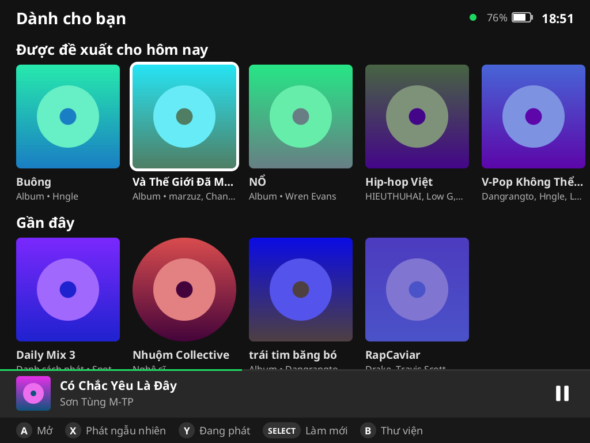
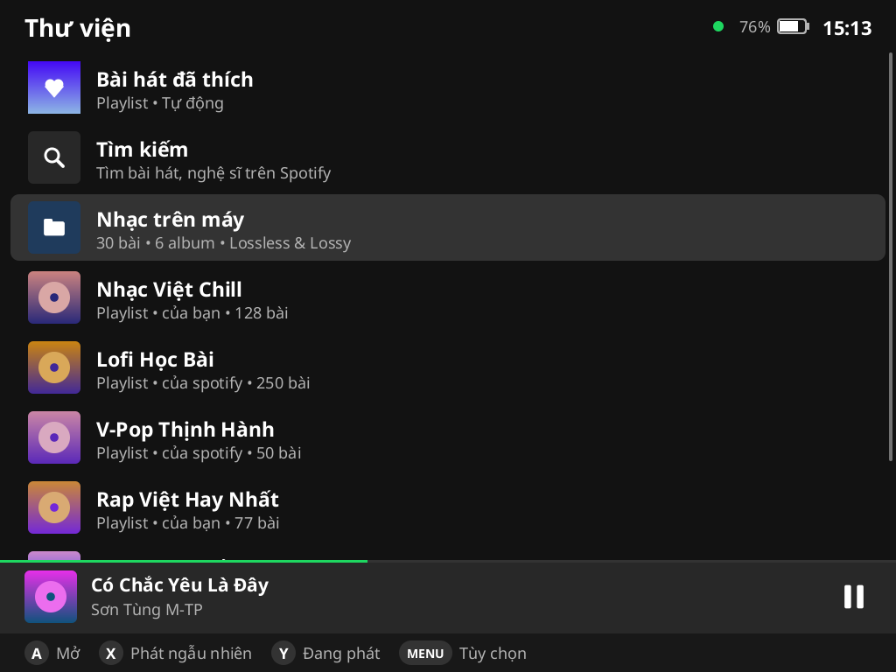
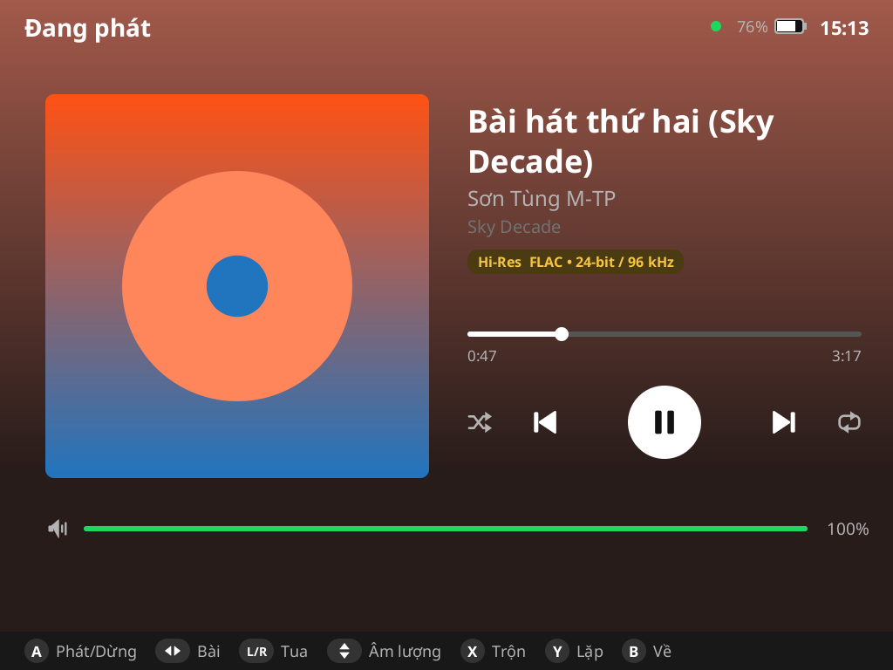
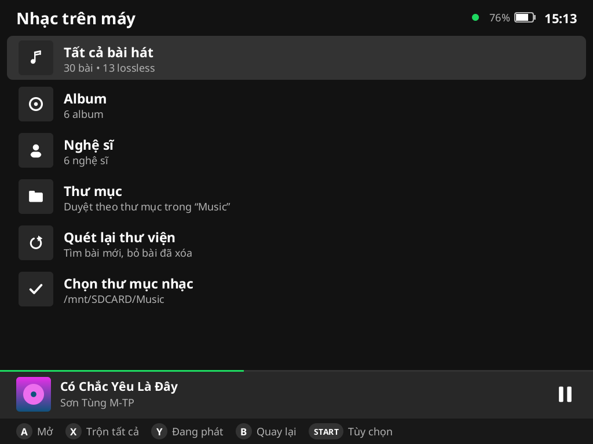
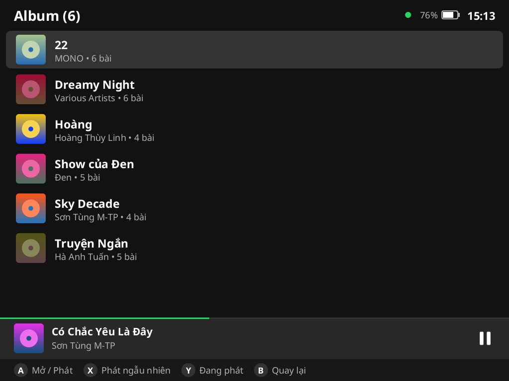
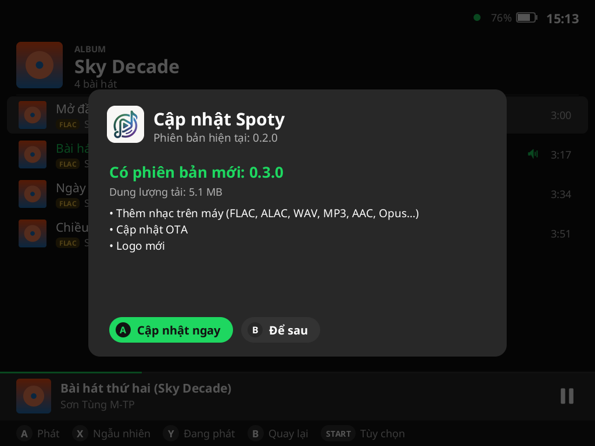
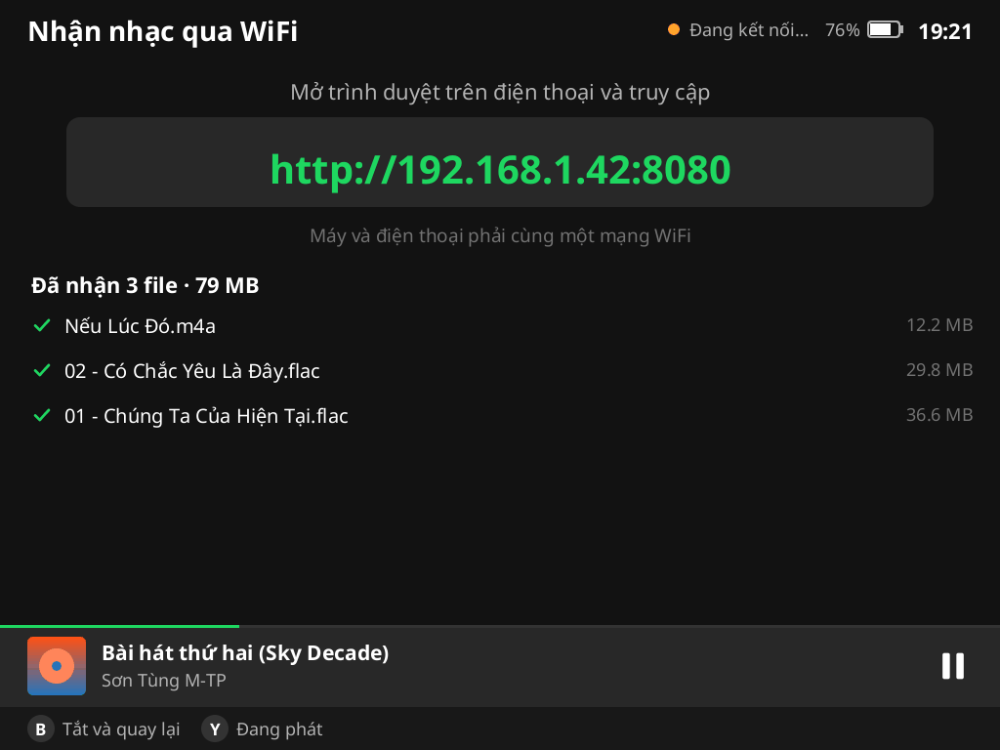
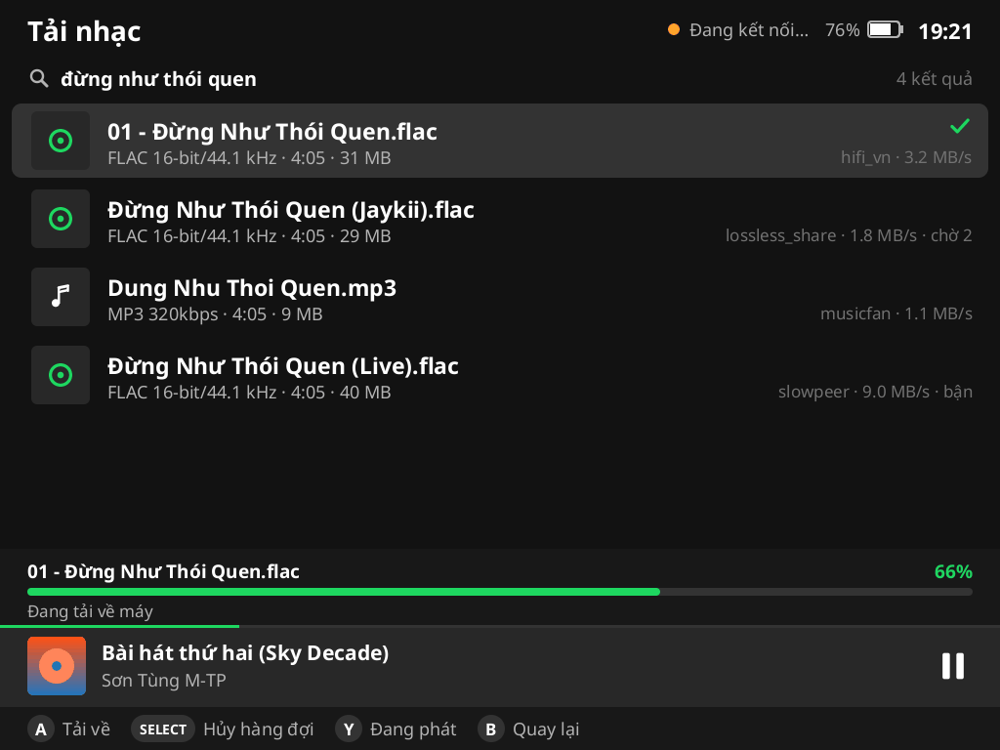

# Spoty: Spotify và nhạc trên máy cho TrimUI Brick / Brick Pro

Spoty là app nghe nhạc cho **TrimUI Brick Pro** (và Brick) chạy **firmware gốc (Stock OS)**:

- **Spotify**: trang **Dành cho bạn** (đề xuất hôm nay, Daily Mix, nghe gần đây…), duyệt thư viện, tìm kiếm và phát ngay trên máy. Hết playlist thì **tự phát tiếp bài tương tự** như app Spotify. Máy cũng là một loa Spotify Connect, điều khiển được từ điện thoại.
- **Nhạc trên máy**: phát file bạn đã tải về, cả **lossless** (FLAC, ALAC, WAV, AIFF) lẫn **lossy** (MP3, AAC, Vorbis, Opus). Chất lượng được giữ tốt nhất có thể, bit-perfect khi phần cứng cho phép.
- **Đưa nhạc vào máy**: nhận file từ điện thoại qua WiFi ngay trong trình duyệt, hoặc tải nhạc lossless từ máy chủ [slskd](https://github.com/slskd/slskd) của riêng bạn.
- **Cập nhật OTA**: app tự báo khi có bản mới và cập nhật ngay trên máy.

| Dành cho bạn | Thư viện | Đang phát (Hi-Res) |
|---|---|---|
|  |  |  |

| Nhạc trên máy | Album trên máy | Cập nhật OTA |
|---|---|---|
|  |  |  |

| Nhận nhạc qua WiFi | Tải nhạc lossless |
|---|---|
|  |  |

## Cài đặt

1. Tải `Spoty-stock.zip` ở [Releases](https://github.com/nomiz1734/Spoty/releases/latest) rồi giải nén (hoặc tự build, xem bên dưới).
2. Chép thư mục `Spoty` vào thẻ nhớ tại `Apps/Spoty` (tức `/mnt/SDCARD/Apps/Spoty`).
3. Trên máy, mở mục **Apps** và chọn **Spoty**.

Từ đó về sau, các bản mới có thể cài bằng OTA ngay trên máy (xem phần [Cập nhật OTA](#cập-nhật-ota)).

## Spotify

Cần tài khoản **Spotify Premium**. librespot, và mọi thiết bị Spotify Connect, chỉ phát được nhạc với tài khoản Premium.

**Đăng nhập lần đầu** qua Spotify Connect, không cần gõ mật khẩu trên máy:

1. Cho máy và điện thoại vào **cùng một mạng Wi-Fi**.
2. Mở app Spotify trên điện thoại, bấm biểu tượng **thiết bị**.
3. Chọn **"TrimUI Brick Pro"**.

Spoty ghi nhớ tài khoản ở `data/account/`. Muốn đổi tài khoản thì chọn **MENU → Đăng xuất Spotify**.

**Dành cho bạn** là trang chủ giống app Spotify: các kệ "Được đề xuất cho hôm nay", "Gần đây", mix hằng ngày, playlist theo nhạc bạn nghe… Đây là đúng nội dung cá nhân hóa mà app Spotify hiển thị. App mở trang này khi kết nối xong. Trang cũng nằm ở dòng đầu của Thư viện, và bấm SELECT để làm mới. Lần mở sau, trang hiện ngay từ bản lưu trước rồi mới cập nhật.

**Tự phát bài tương tự (autoplay):** khi playlist hoặc album phát hết, Spotify tự nối tiếp các bài đề xuất, giống app chính thức. Tắt bằng `"autoplay": false`.

## Nhạc trên máy

1. Mở **Thư viện → Nhạc trên máy**. Khi chưa đăng nhập Spotify, bấm **X** ngay ở màn hình đăng nhập.
2. Chọn **Chọn thư mục nhạc**, đi tới thư mục chứa nhạc (ví dụ `/mnt/SDCARD/Music`) rồi chọn **Dùng thư mục này** (hoặc bấm START).
3. Spoty chỉ quét trong thư mục đó và các thư mục con. Nó bỏ qua:
   - file nhỏ hơn 48 KB (âm báo, nhạc chuông),
   - thư mục ẩn,
   - thư mục hệ thống như `Android`, `Notifications`, `Ringtones`.
4. Duyệt nhạc theo **Tất cả bài hát**, **Album**, **Nghệ sĩ** hoặc **Thư mục**. Bấm **X** để phát ngẫu nhiên.

Album được gom theo **nghệ sĩ chính**, nên các bài có nghệ sĩ góp giọng ("RPT MCK, tlinh", "Lil Wuyn/ VSoul") vẫn nằm trong cùng một album. Mục **Nghệ sĩ** liệt kê bài hát dưới mọi nghệ sĩ tham gia. Khi hàng đợi phát hết, app **tự phát tiếp** các bài khác của cùng nghệ sĩ, rồi đến bài ngẫu nhiên trong thư viện (cùng tùy chọn `autoplay`).

Lần quét sau chỉ đọc lại những file mới hoặc đã thay đổi (dựa vào kích thước và thời gian sửa), nên rất nhanh. Chọn **Quét lại thư viện** sau khi chép thêm nhạc.

### Nhận nhạc qua WiFi

Không cần tháo thẻ nhớ: **MENU → Nhận nhạc qua WiFi**. Máy hiện một địa chỉ dạng `http://192.168.1.42:8080`; mở địa chỉ đó trên điện thoại (cùng mạng WiFi), kéo thả file vào trang là xong. File được lưu thẳng vào thư mục nhạc và thư viện tự quét lại khi bạn thoát màn hình.

Server chỉ chạy khi màn hình này đang mở, chỉ nhận đúng các định dạng nhạc ở trên, và tên file được làm sạch trước khi lưu. Bấm **B** để tắt.

### Tải nhạc lossless (slskd)

Nếu bạn tự dựng một máy chủ [slskd](https://github.com/slskd/slskd) (xem `implementation_plan.md` và `PHASE1-SETUP-GUIDE.md`), điền `slskd_url` và `slskd_api_key` vào `settings.json` rồi chọn **MENU → Tải nhạc**. Gõ tên bài (có cả bộ gõ Telex; app tự tìm thêm bản không dấu vì nhiều file trên Soulseek đặt tên không dấu), chọn bản muốn tải, app tải về thẳng thư mục nhạc: ưu tiên nguồn còn chỗ trống và bản lossless, tải một file một lúc, rớt mạng thì tải tiếp chứ không tải lại từ đầu.

Mục menu này chỉ hiện khi đã điền `slskd_url`.

**Tên bài, nghệ sĩ, album** lấy từ tag trong file (ID3, Vorbis comment, MP4). Nếu file không có tag, Spoty dùng tên file làm tên bài và tên thư mục làm tên album. **Ảnh bìa** lấy từ ảnh nhúng trong file; nếu không có thì dùng `cover.jpg`, `folder.jpg`, `front.jpg` (hoặc `.png`) nằm cạnh file.

### Định dạng hỗ trợ

| Loại | Định dạng |
|---|---|
| Lossless | FLAC (tới 24-bit / 192 kHz), ALAC (`.m4a`), WAV, AIFF |
| Lossy | MP3, AAC-LC (`.m4a`, `.aac`), Ogg Vorbis, Opus (`.opus`, `.ogg`, `.webm`) |

Chưa hỗ trợ: APE, WavPack, DSD, Opus nhiều kênh. File HE-AAC vẫn phát được nhưng thiếu phần tần số cao.

### Chất lượng âm thanh

- **Bit-perfect**: khi âm lượng trong app ở **100%** và ReplayGain tắt, mẫu âm thanh được ghi thẳng ra thiết bị, đúng tần số và độ sâu bit gốc. Nguồn 16-bit và 24-bit đều giữ nguyên, không qua xử lý nào.
- **Xuất 32-bit**: khi phần cứng hỗ trợ, âm lượng thấp hơn 100% vẫn không mất độ phân giải.
- **Resample FFT chất lượng cao**: chỉ dùng khi thiết bị không chạy được tần số gốc của file. Resample mặc định của ALSA thì chất lượng kém hơn.
- **Dither TPDF**: dùng khi buộc phải hạ xuống 16-bit.
- **Gapless**: các bài cùng tần số phát liền nhau, không có khoảng lặng giữa các bài (album live, album concept…).
- Âm lượng thay đổi mượt, không gây tiếng lụp bụp. ReplayGain theo bài hoặc theo album là tùy chọn.
- Nhãn chất lượng trên từng bài: xanh lá là lossless, vàng là **Hi-Res** (24-bit hoặc trên 48 kHz).

Mẹo để nghe đúng chất lượng gốc: để âm lượng Spoty ở 100% và chỉnh âm lượng bằng nút cứng của máy. Nếu `grab_power_button` bật và nút âm lượng nằm chung thiết bị với nút nguồn, nút âm lượng sẽ điều khiển âm lượng trong app. Khi đó, tắt `grab_power_button` để nút cứng quay về chỉnh âm lượng hệ thống.

Spotify và nhạc trên máy **dùng chung loa**: bên này phát thì bên kia tự tạm dừng.

## Điều khiển

| Nút | Danh sách | Đang phát | Tìm kiếm / Chọn thư mục |
|---|---|---|---|
| D-pad / joystick trái | Di chuyển (giữ để cuộn nhanh) | ◀▶ bài trước/sau, ▲▼ âm lượng | Di chuyển |
| Nhấn joystick (L3) | Phát / Dừng (ở mọi màn hình) | Phát / Dừng | Phát / Dừng |
| A | Mở / phát bài | Phát / Dừng | Gõ phím / vào thư mục |
| B | Quay lại | Quay lại | Xóa ký tự / lên thư mục cha |
| X | Phát ngẫu nhiên | Bật/tắt trộn bài | Dấu cách / chọn thư mục |
| Y | Mở Đang phát | Lặp: tắt → danh sách → 1 bài | — |
| L1 / R1 | Lên/xuống 1 trang | Tua −15s / +15s | L1: đổi bàn phím VI / EN |
| L2 / R2 | Về đầu / cuối danh sách | — | Di chuyển con trỏ trong ô tìm kiếm |
| SELECT | Nhảy tới bài đang phát | — | Xóa hết / hủy |
| START | Tùy chọn (mở album/nghệ sĩ…) | Tùy chọn | Tìm / chọn thư mục |
| MENU | Menu: nhạc trên máy, tải nhạc, nhận nhạc qua WiFi, cập nhật, tắt màn hình, đăng xuất, **thoát** | | |
| Nguồn | Tắt/bật màn hình, **nhạc vẫn phát** | | |

Ở **Dành cho bạn**: ▲▼ đổi kệ, ◀▶ chọn thẻ (L1/R1 nhảy 4 thẻ), A mở, X phát ngẫu nhiên, SELECT làm mới.

**Tìm kiếm** gõ được tiếng Việt kiểu **Telex**: `s f r x j` là dấu sắc/huyền/hỏi/ngã/nặng, `z` bỏ dấu, `aa ee oo` = â ê ô, `aw ow uw` = ă ơ ư, `dd` = đ. Dấu gõ ở cuối từ cũng được (`tinhf` → tình, `dduwowngf` → đường). Gõ lặp phím để bỏ (`ff` → f). Nút **VI | EN** ở góc trái bàn phím (hoặc **L1**) chuyển sang gõ tiếng Anh cho tên bài nước ngoài; app nhớ lựa chọn này. Muốn sửa chữ đã gõ, gạt **cần analog phải** trái/phải (hoặc **L2/R2**) để đưa con trỏ về chỗ cần sửa, rồi gõ hoặc xóa ngay tại đó — Telex cũng bỏ dấu được cho từ ngay trước con trỏ; gạt lên/xuống để về đầu/cuối. Nút **✕** trong ô tìm kiếm xóa hết chữ: bấm ▲ từ hàng phím số để tới nút rồi bấm A, hoặc bấm SELECT. Khi ô trống, B quay lại.

## Cập nhật OTA

**Trên máy:** Spoty tự kiểm tra bản mới khoảng 8 giây sau khi mở (cần Wi-Fi). Khi có bản mới, app hiện thông báo; vào **MENU → Cập nhật lên phiên bản …**, bấm **A** để tải về, rồi **A** để khởi động lại. Nhạc vẫn phát trong lúc tải.

Cách cập nhật được bảo vệ:
- Chỉ tải qua HTTPS, kiểm tra SHA-256, và chỉ nhận binary ARM64.
- `settings.json` và dữ liệu (tài khoản, thư viện, cache) được giữ nguyên.
- Bản cũ được giữ lại thành `spoty.old`. Nếu bản mới lỗi ngay khi khởi động, `launch.sh` tự khôi phục bản cũ.

**Phát hành bản mới.** Repo: <https://github.com/nomiz1734/Spoty>. App đọc `update.json` của release mới nhất, địa chỉ lưu trong `update-url.txt`:

1. Tăng `version` trong `Cargo.toml` (ví dụ `0.2.1`), ghi thay đổi vào `release-notes.txt`.
2. Commit và `git push`.
3. Chạy `.\build.ps1 -Publish`. Lệnh này build, tạo release `v<version>` trên GitHub và tải lên `update.json`, `spoty-update.tar.gz`, `Spoty-stock.zip`. Việc đăng nhập GitHub dùng tài khoản Git đã lưu sẵn, không cần token riêng.

Các máy đang chạy Spoty sẽ tự thấy bản mới ở lần mở app tiếp theo. Có thể đổi nguồn cập nhật bằng khóa `update_url` trong `settings.json`.

Tải bản mới nhất để cài lần đầu: [Releases](https://github.com/nomiz1734/Spoty/releases/latest).

## Cấu hình: `Apps/Spoty/settings.json`

File này được tạo ở lần chạy đầu tiên, và tự thêm các khóa mới sau mỗi lần cập nhật.

| Khóa | Mặc định | Ý nghĩa |
|---|---|---|
| `music_dir` | `""` | Thư mục nhạc (chọn ngay trong app) |
| `audio_output_format` | `"auto"` | `auto`: ưu tiên 32-bit, không được thì 16-bit. `s32` hoặc `s16` để ép một định dạng |
| `replaygain` | `"off"` | `off` / `track` / `album` (cho nhạc trên máy) |
| `local_volume` | `100` | Âm lượng nhạc trên máy (%). 100 = bit-perfect |
| `update_url` | *(lúc build)* | URL `update.json` cho OTA (`""` = tắt) |
| `auto_update_check` | `true` | Tự kiểm tra bản mới khi mở app |
| `autoplay` | `true` | Hết playlist/album thì tự phát bài tương tự (Spotify và nhạc trên máy) |
| `time_zone` | `""` | Múi giờ cho trang Dành cho bạn (`""` = của máy, mặc định Asia/Ho_Chi_Minh) |
| `search_keyboard` | `"vi"` | Bàn phím tìm kiếm: `vi` (Telex) hoặc `en` |
| `slskd_url` | `""` | Máy chủ slskd riêng để tải nhạc, ví dụ `https://nhac.duckdns.org` (`""` = tắt). Đang thử nghiệm, chưa có giao diện |
| `slskd_api_key` | `""` | API key của máy chủ đó (gửi qua `X-Api-Key`, bắt buộc HTTPS) |
| `slskd_lan_url` | `""` | Địa chỉ của cùng máy chủ trong mạng nhà, ví dụ `http://192.168.1.230:5080`. Ở nhà Spoty đi thẳng đường này, ra ngoài tự chuyển về `slskd_url`. `http://` chỉ được phép với địa chỉ trong mạng nhà |
| `slskd_delete_after` | `true` | Xóa file trên máy chủ sau khi máy đã tải về. `false` để giữ lại (ví dụ làm thư viện trên NAS) |
| `device_name` | `"TrimUI Brick Pro"` | Tên hiện trong danh sách Spotify Connect |
| `bitrate` | `320` | Chất lượng Spotify: 96 / 160 / 320 kbps |
| `initial_volume` | `70` | Âm lượng Spotify lần đầu (%) |
| `volume_step` | `5` | Mức tăng/giảm âm lượng mỗi lần bấm (%) |
| `audio_device` | `"default"` | Thiết bị ALSA |
| `audio_latency_ms` | `120` | Bộ đệm âm thanh (nhạc trên máy tối thiểu 200). Tăng lên nếu tiếng bị rè hoặc ngắt |
| `audio_cache_mb` | `1024` | Cache nhạc Spotify trên thẻ (0 = tắt) |
| `normalize` | `false` | Cân bằng âm lượng Spotify |
| `screen_off_after_s` | `120` | Tự tắt màn hình khi đang phát (0 = không tắt) |
| `grab_power_button` | `true` | Dùng nút nguồn để tắt/bật màn hình |
| `rotate` | `0` | Xoay hình 0/90/180/270 |
| `fb_double_buffer` | `false` | Lật trang framebuffer (thử nếu thấy hình bị xé) |
| `keymap` | `{}` | Đổi mã phím, ví dụ `{"305": "A"}` |

## Xử lý sự cố

- **Nhật ký:** `data/spoty.log`; nếu app không mở được thì xem `data/launch.log`; lịch sử khôi phục bản cũ nằm ở `data/update.log`.
- **Lệnh kiểm tra** (chạy qua SSH trên máy, trong thư mục `Apps/Spoty`):
  - `./spoty --decode-test file.flac …`: giải mã trọn file, in định dạng, thời lượng, tốc độ giải mã, ảnh bìa.
  - `SPOTY_TEST_VOLUME=30 ./spoty --play-test a.flac b.mp3`: phát thật qua loa và in từng sự kiện.
  - `./spoty --scan-test /mnt/SDCARD/Music`: quét thư mục như app.
  - `./spoty --update-check <url>`: thử đọc `update.json`.
  - `./spoty --home-test`: tải trang Dành cho bạn bằng tài khoản đã lưu và in các kệ.
  - `./spoty --slskd-test <từ khóa>`: tìm nhạc trên máy chủ slskd và in kết quả đã xếp hạng.
  - `./spoty --slskd-get <từ khóa>`: tải bản tốt nhất về thư mục nhạc, in tiến trình cả hai chặng.
- **Không thấy máy trong danh sách thiết bị trên điện thoại:** kiểm tra hai máy cùng Wi-Fi. Router có thể đang chặn mDNS giữa các thiết bị (chế độ "AP isolation" hoặc mạng khách).
- **Nút bấm bị lệch:** chạy với `SPOTY_LOG=debug` để thấy mã phím chưa được gán, rồi thêm vào `keymap`.
- **Không có tiếng / tiếng rè:** thử `"audio_output_format": "s16"`, `"audio_device": "hw:0,0"`, hoặc tăng `audio_latency_ms`.

## Build từ mã nguồn (Windows)

```powershell
rustup-init.exe -y --default-host x86_64-pc-windows-gnu --profile minimal
rustup target add aarch64-unknown-linux-gnu x86_64-pc-windows-gnu
pip install --user ziglang cargo-zigbuild
.\build.ps1                    # dist\Spoty, dist\Spoty-stock.zip, dist\update\*
.\build.ps1 -Screenshots       # kèm ảnh chụp mọi màn hình
```

- Binary nhắm tới glibc 2.17 (chạy được trên firmware cũ). `libasound` được nạp động lúc chạy, nên không cần sysroot ARM.
- Icon và logo được tạo lại từ `assets/brand/logo-source.png` bằng `python tools/make_brand.py`.
- Chạy trên PC có cửa sổ và âm thanh: `cargo zigbuild --release --features desktop --target x86_64-pc-windows-gnu`. Phím: mũi tên, Z=A, X=B, S=X, A=Y, Q/W=L1/R1, Enter=START, Esc=MENU, P=nguồn.

## Kiến trúc

```
src/
  main.rs            khởi động + các lệnh kiểm tra (--decode-test, --play-test, …)
  spotify/           librespot: đăng nhập Connect, Spirc, thư viện, ảnh bìa
  local/             nhạc trên máy
    library.rs       quét thư mục, cache theo kích thước/thời gian sửa
    decode.rs        Symphonia (FLAC/ALAC/PCM/MP3/AAC/Vorbis) + Opus
    player.rs        luồng phát: bit-perfect, gapless, resample FFT, dither, ReplayGain
    art.rs           ảnh bìa nhúng / cover.jpg
  audio/             ALSA qua dlopen (dùng chung cho cả hai player), rodio trên PC
  update.rs          OTA: kiểm tra, tải (HTTPS + SHA-256), cài, khôi phục
  ui/                trạng thái, phím, vòng lặp khung hình, vẽ từng màn hình
  gfx/               canvas phần mềm, chữ, icon vector, JPEG/PNG
  platform/          /dev/fb0, evdev, đèn nền, pin; cửa sổ minifb trên PC
vendor/opus-decoder  bộ giải mã Opus thuần Rust (MIT/Apache-2.0), đã thay DFT O(N²) bằng rustfft
                     để giải mã nhanh hơn khoảng 60 lần
```

Phần Spotify dùng API nội bộ qua [librespot](https://github.com/librespot-org/librespot) 0.8, không dùng Web API. Từ đầu năm 2026, Spotify tạm dừng việc tạo app mới cho nhà phát triển.

## Hạn chế

- Spotify có thể đổi API nội bộ bất cứ lúc nào; khi đó cần cập nhật librespot (qua OTA).
- Tìm kiếm Spotify chỉ trả về bài hát.
- Spotify không hỗ trợ lossless cho librespot; tối đa 320 kbps Ogg Vorbis. Lossless chỉ có với nhạc trên máy.
- Dự án cá nhân, không liên kết với Spotify.
